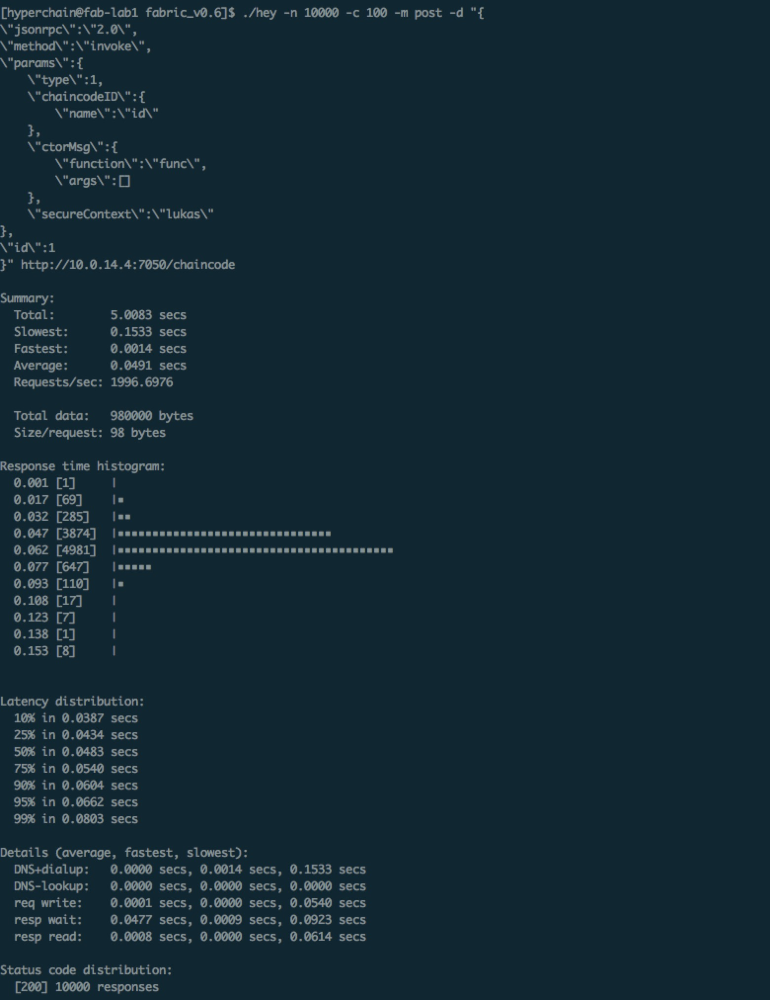
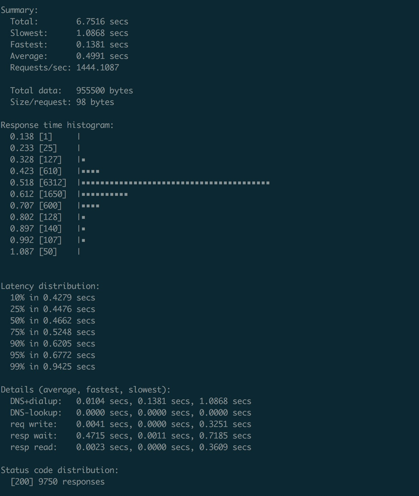

## Fabric-v0.6-preview性能测试报告

### 测试环境

- 微软云内网环境
- 节点数量 `4`
- 服务器  `4核8G`（四台）
- cup型号 `Intel(R) Xeon(R) CPU E5-2660 0 @ 2.20GHz`
- 使用Fabric默认配置

### 压测工具 

`hey` (https://github.com/rakyll/hey)

#### 压测命令

发送请求数量：10000

并发数：100

```bash
./hey -n 10000 -c 100 -m post -d "{
\"jsonrpc\":\"2.0\",
\"method\":\"invoke\",
\"params\":{
    \"type\":1,
    \"chaincodeID\":{
        \"name\":\"id\"
    },
    \"ctorMsg\":{
        \"function\":\"func\",
        \"args\":[]
    },
    \"secureContext\":\"lukas\"
},
\"id\":1
}" http://10.0.14.4:7050/chaincode
```
#### 测试结果

 

#### 压测命令

发送请求数量：10000

并发数：750

```bash
./hey -n 10000 -c 1250 -m post -d "{
\"jsonrpc\":\"2.0\",
\"method\":\"invoke\",
\"params\":{
    \"type\":1,
    \"chaincodeID\":{
        \"name\":\"id\"
    },
    \"ctorMsg\":{
        \"function\":\"func\",
        \"args\":[]
    },
    \"secureContext\":\"lukas\"
},
\"id\":1
}" http://10.0.14.4:7050/chaincode
```

#### 测试结果



### 测试日志

测试日志为目录下`test.log`

